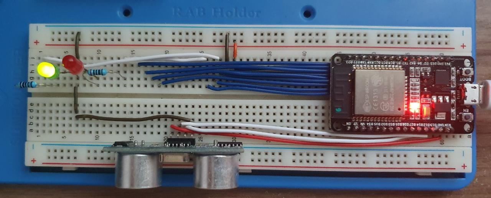
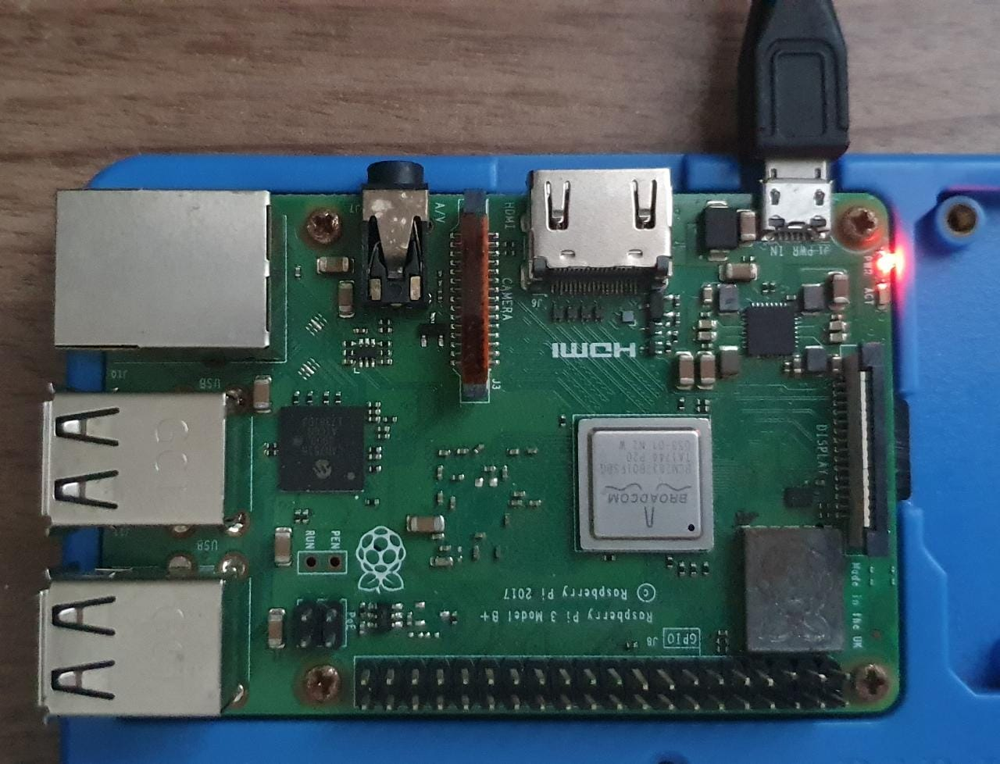

# MATD02

Trabalho para composição final de nota para a matéria Topicos em Sistemas de Informação
com foco em IOT.

Projeto: Controle de vagas em um estacionamento.

Componentes:
* Airton Serra
* Hérson Rezende
* Viginia Lucia Pinto

Trata-se de um circuito simulado de controle de vagas de estacionamento.
Sendo um sensor real e os demais virtuais.

Lista de material  - Prototipo:
* Microprocessador ESP32
* Sensor HC-SD04
* Leds Vermelho e Verde
* Resistores 1K ohms
* Fios jumper

Sistemas utilizados:
* Broker mosquitto mqtt 
* Paho mqtt 
* Python
* HTML , CSS e JS

! [Utilizaremos o sensor HCSR04 - Sensor Ultrasonico](https://i1.wp.com/randomnerdtutorials.com/wp-content/uploads/2021/06/how-ultrasonic-sensor-works-01.png?w=750&quality=100&strip=all&ssl=1)

Imagens   | Prototipo
--------- | ------
 |
 |

