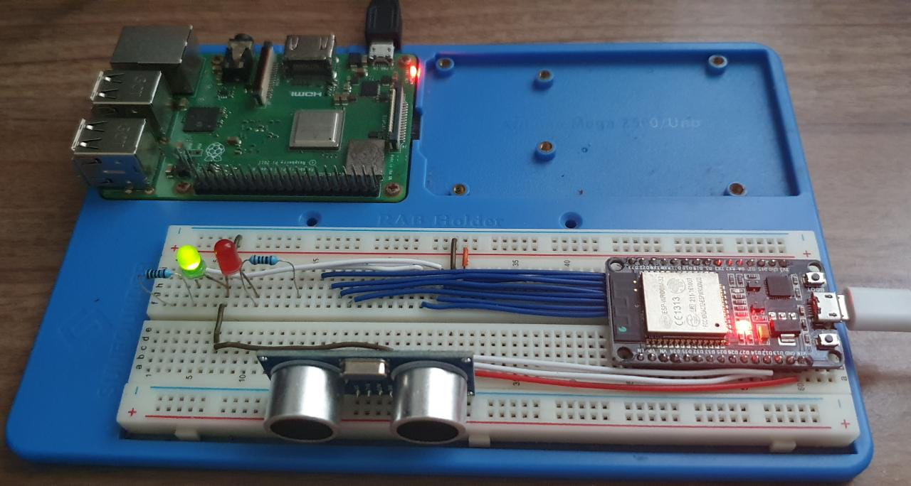
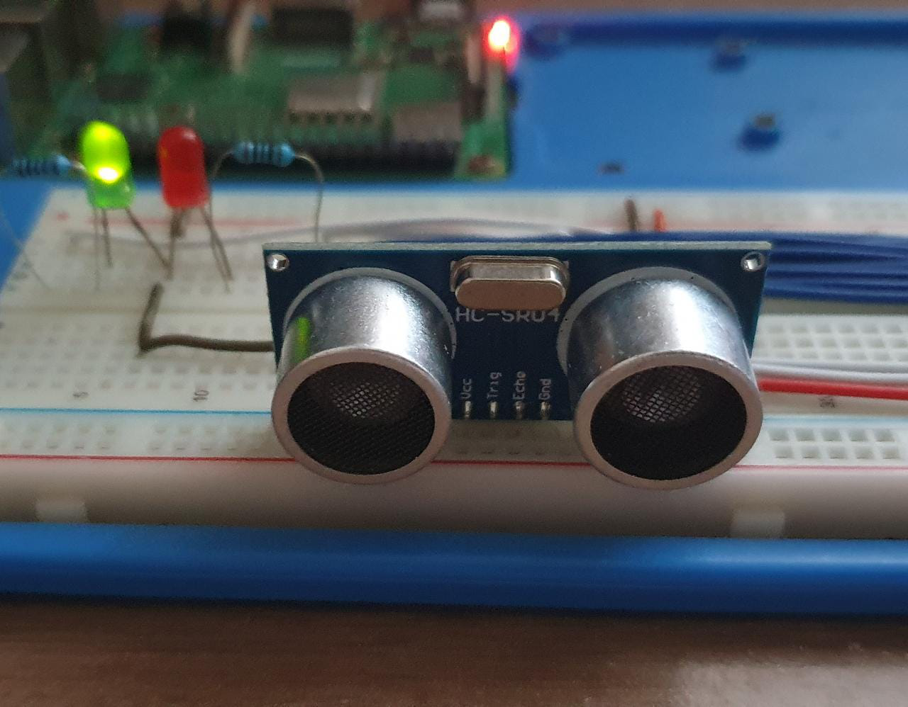

# MATD02

Trabalho para composição final de nota para a matéria Topicos em Sistemas de Informação
com foco em IOT.

Projeto: Controle de vagas em um estacionamento.

[Projeto IOT - MATD02](https://tinyurl.com/MATD02)

Componentes:
* Airton Serra
* Hérson Rezende
* Viginia L. Pinto

Trata-se de um circuito simulado de controle de vagas de estacionamento.
Sendo um sensor real e os demais virtuais.

Lista de material  - Prototipo:
* Microprocessador ESP32
* Sensor HC-SD04
* Leds Vermelho e Verde
* Resistores 1K ohms
* Fios jumper

Sistemas utilizados:
<<<<<<< HEAD
* Broker mosquitto mqtt - Raspberry Pi 3B
* Paho mqtt 
* Python
* HTML , CSS, Node, Javascript

! [Utilizamos o sensor HCSR04 - Sensor de Distancia](https://i1.wp.com/randomnerdtutorials.com/wp-content/uploads/2021/06/how-ultrasonic-sensor-works-01.png?w=750&quality=100&strip=all&ssl=1)

=======
* Broker mosquitto mqtt  -- Raspberry Pi 3B
* Paho mqtt 
* Python
* HTML, CSS, JS, NODE.JS
* App Rodando na plataforma Heroku

! [Utilizamos o sensor HCSR04 - Sensor de Distancia](https://i1.wp.com/randomnerdtutorials.com/wp-content/uploads/2021/06/how-ultrasonic-sensor-works-01.png?w=750&quality=100&strip=all&ssl=1)

Imagens   | .
--------- | ------
 |
 |
>>>>>>> a03623f8249b1eb5e8c6270ee27e99d8c1b6451a
